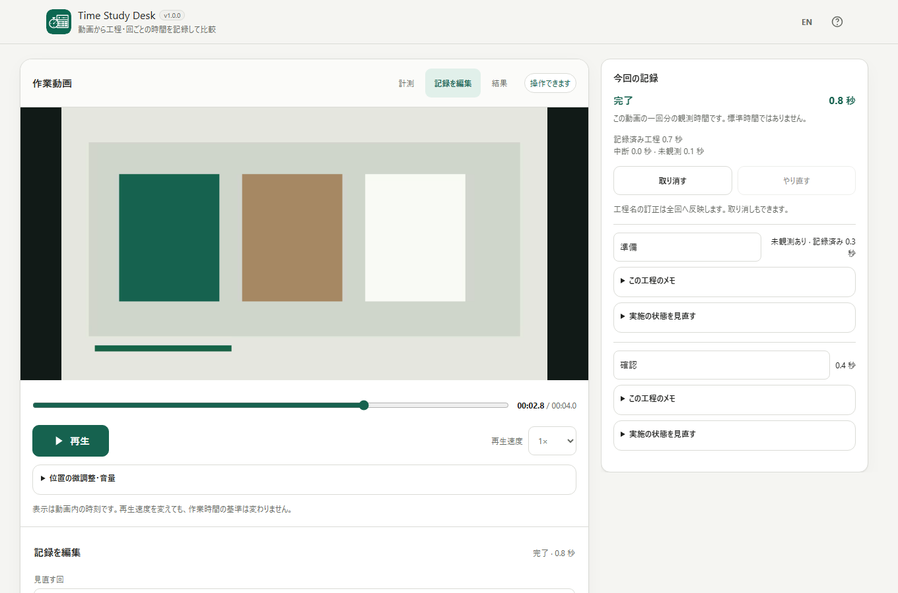

# Time Study Desk / 動画作業分析

[](https://github.com/ttomohisa/htmlapps-time-study-desk/actions/workflows/test-app.yml)
[](LICENSE)
[](https://github.com/ttomohisa/htmlapps-time-study-desk/actions/workflows/build-standalone.yml)

[English README](README.md)

**動画を見ながら工程の時間を計測し、繰り返し作業の各回を比較する**単一HTMLアプリです。工程の区切りを記録し、結果を確認して、数値から該当する動画の区間へ戻れます。登録やインストールは不要で、選択した動画や分析データをアプリからサーバーへ送信しません。

## 🚀 デモ

### [GitHub PagesでTime Study Deskを開く](https://ttomohisa.github.io/htmlapps-time-study-desk/)

GitHub Pagesが**このリポジトリで有効になっている場合**、最初のHTMLが配信されます。読み込んだ動画や計測記録はブラウザ内で処理されます。デモが開けない場合は、下の「すぐに使う」から単一HTMLを入手してください。

[](https://ttomohisa.github.io/htmlapps-time-study-desk/)

*実際のv1.0.0をChromiumで動かして撮影した画面です。映像は短い合成テスト素材で、実作業を計測したものではありません。[スマートフォン画面](assets/screenshot-mobile.png)。*

## 主な機能

- **動画を工程ごとに計測する** — 再生位置を見ながら開始・工程の切替・終了を記録。最初の回は工程名を決めていなくても始められます。
- **繰り返し作業を比較する** — 同じ手順を使って2回目以降を明示的に開始。回と回の間の時間は、作業時間へ足しません。
- **計測できなかった部分を区別する** — 中断、未観測、実施なしを分けて記録し、分からない時間を0秒として扱いません。
- **記録をあとから直せる** — 工程名、隣り合う工程の境界、区間の分割・結合・割当て、実施状態、メモを編集。元に戻す／やり直すにも対応します。
- **数値の根拠を動画で確かめる** — 回別・工程別の統計、母数（n）、時間表、グラフを表示。結果の数値から該当する動画の区間へ移動できます。
- **分析データを端末内で保存・出力する** — 動画を含まない分析JSON、利用可能な環境での自動保存、時間表／集計／区間明細のCSVを利用できます。

## すぐに使う

### Webで使う

GitHub Pagesが有効な場合は、[デモを開く](https://ttomohisa.github.io/htmlapps-time-study-desk/)だけで使えます。登録・インストールは不要です。ページの最初の取得には通信が必要ですが、動画の分析にサーバー処理は使用しません。

### ダウンロードして使う

1. [単一HTMLのビルド](https://github.com/ttomohisa/htmlapps-time-study-desk/actions/workflows/build-standalone.yml)から成功した実行を開きます。
2. **standalone-html-…** という成果物（Artifact）のZIPをダウンロードします。GitHub上のArtifact取得にサインインが必要な場合があります。
3. ZIPを展開し、`dist/index.html` を対応ブラウザで開きます。同梱の `time-study-desk.html` は通常版と同じ内容です。
4. 小さい `dist/index.self-extract.html` も利用できますが、ブラウザの `DecompressionStream` 対応が必要です。

いずれもローカルサーバーや、実行時の追加ライブラリ取得は不要です。HTMLを保存しておけば、次回からネット接続なしで開けます。

### 自分でオフライン版を作る（上級者向け）

1. このリポジトリをダウンロードまたはクローンします。
2. Windowsで `build-standalone.bat` を実行します（PowerShellが必要です）。
3. 生成された `dist/index.html` をそのまま開くか、ほかの端末へコピーして使います。

Node.jsやPlaywrightは**アプリの実行時には不要**です。開発・テストでのみ使用します。

## 使い方

1. **動画を読み込む。** ファイル選択かドラッグ＆ドロップで、シークできる動画1本を追加し、作業開始位置へ移動します。
2. **最初の回を計測する。** 「ここから開始」を押し、工程が変わる位置で「ここで区切る」、作業の最後に「この回を終了」を押します。
3. **次の回を記録する。** 「次の回をここから開始」を選びます。次の回は自動で始まらず、回間の時間も勝手には加算されません。
4. **記録を編集する。** 「記録を編集」で工程名・境界・区間・実施状態などを直します。工程順や開始／終了条件が変わる場合は新しい手順として扱い、過去の記録を維持します。
5. **結果を確認する。** 「結果」で対象の手順を選び、回ごとの時間、工程別平均、時間表を確認します。完了した回を集計対象から外す場合は理由を入力します。
6. **保存する。** 「分析データを保存」で `.tsd.json` を取得するか、必要な種類のCSVをそれぞれ保存します。

### 中断・未観測・実施なし

計測中の「その他の記録」から中断または観測できない区間を開始し、「工程へ戻る」で再開します。**動画の一時停止は、作業の中断を記録する操作ではありません。** 「この工程は実施なし」は、計測済み0秒とは異なる状態です。未完了の回は自動で完了になりません。

### 記録の修正と根拠映像

共有境界を移動すると、隣り合う2工程の時間が変わります。区間の分割・結合・割当て変更でも、観測した時間を勝手に消したり、不明な時間を補ったりしません。根拠が不足した工程は未確定になる場合があります。

結果画面の数値を選ぶと、「記録を編集」で該当区間の開始位置へ移動します。**自動再生はしません。** 「この区間を再生」を押すとその区間を再生します。フレーム単位での厳密なシーク・停止は保証しません。

### キーボード操作

| ショートカット | 操作 |
| --- | --- |
| プレイヤーにフォーカスして `Space` | 再生／一時停止 |
| プレイヤーで `←` / `→` | 0.1秒ずつ移動 |
| `Shift` + 矢印 | 1秒ずつ移動 |
| `Ctrl` / `⌘` + `Z` | 記録の取り消し（文字入力中は文字のUndo） |
| `Ctrl` / `⌘` + `Shift` + `Z` | 記録のやり直し |
| `Esc` | ダイアログを閉じる |

### 保存・再読込・CSV

- **分析JSON（`.tsd.json`）** は手順・回・境界時刻・状態・メモを保存します。**元の動画は含まれません。** 再読込後は動画を選び直します。ファイルのメタデータを照合し、利用前に確認を求めますが、メタデータが一致しても同じ動画とは限りません。
- **自動保存** は対応ブラウザのIndexedDBに分析だけを保存します。動画は保存しません。ブラウザの設定や保存領域の削除により使えなくなる可能性があり、保存の永続性や暗号化も保証されません。重要な分析はJSONとして別途保存してください。古いタブが新しい保存内容を無断で上書きすることも防ぎます。
- **CSV** は「時間表」「集計」「区間明細」を1種類ずつ出力します。UTF-8 BOM、CRLF、全セル引用に対応し、未観測と0秒を区別します。表計算ソフトで数式として解釈されそうな利用者の文字列はCSVでのみ保護します。詳しくは [CSV仕様](docs/CSV_FORMAT.md) を参照してください。

「ダウンロードを開始しました」はブラウザへ引き渡したことを示すだけで、指定フォルダへの保存完了を保証しません。

## GitHub Pagesで公開する

このリポジトリには単一HTMLをビルドしてGitHub Pagesへ公開するワークフローがあります。

1. リポジトリの **Settings → Pages → Build and deployment → Source** で **GitHub Actions** を選びます。
2. `main` にプッシュするか、[Actions](https://github.com/ttomohisa/htmlapps-time-study-desk/actions/workflows/deploy-pages.yml)の **Deploy standalone app to GitHub Pages** を実行します。
3. デプロイが成功すると、`https://ttomohisa.github.io/htmlapps-time-study-desk/` で利用できます。

Pagesが無効の場合はHTMLのビルドのみを行い、公開処理はスキップします。アプリのテスト成功だけでは、公開済みとは判断できません。

## 開発とビルド

```text
.
├─ app.config.json                   # アプリ情報・ビルド設定
├─ src/index.template.html           # アプリ本体の編集対象
├─ build-standalone.bat              # Windows用ビルド入口
├─ build-standalone.ps1              # 単一HTMLビルダー
├─ scripts/check-repository.ps1      # ビルド・配布物の検証
├─ dist/index.html                   # 生成される通常版HTML
├─ dist/index.self-extract.html      # 生成される自己展開版HTML
├─ time-study-desk.html              # 生成される通常版のルートコピー
└─ .github/workflows/
   ├─ build-standalone.yml          # 単一HTMLのビルド検証
   ├─ test-app.yml                  # Unit・Chromiumブラウザ試験
   └─ deploy-pages.yml              # 有効時のみPagesに公開
```

アプリを編集するときは `src/index.template.html` を変更し、再ビルドします。**生成されたHTMLを直接編集しないでください。** Windowsでのビルド・検証は以下を実行します。

```powershell
pwsh -NoProfile -File ./scripts/check-powershell-syntax.ps1
pwsh -NoProfile -File ./scripts/check-repository.ps1
```

開発用テストにはNode.js 22系と固定バージョンのPlaywright 1.57.0を使います。

```sh
npm ci
npx playwright install chromium
npm run test:unit
npm run test:e2e -- --project=chromium
```

ビルドでは2種類の内包HTMLを生成し、相互の整合性や実行時ネットワーク制限を検査します。詳しくは [APP_SPEC.md](APP_SPEC.md)、[保存形式](docs/SAVE_FORMAT.md)、[QA記録](docs/QA_RESULTS.md) を参照してください。最新の試験画面と結果は [アプリテスト](https://github.com/ttomohisa/htmlapps-time-study-desk/actions/workflows/test-app.yml)の **time-study-evidence-…** 成果物にもあります。

## プライバシーと通信防止

生成HTMLには `connect-src 'none'` を含むCSPを設定し、アプリ実行時に外部API、CDN、フォント、解析サービス、テレメトリーを使用しません。動画はブラウザのFile/Blob URLで扱い、分析は端末内で実行します。自動保存が使える場合はブラウザ内、書き出しは利用者が選んだダウンロードです。

GitHubやPagesの最初のページ取得には通常のWeb通信がありますが、**選択した動画、ファイル名、工程名、メモをアプリから外部へ送信しません。** ネットワークなしで使う場合は、保存済みの単一HTMLをローカルで開いてください。詳細は [SECURITY.md](SECURITY.md) と [VERIFY_OFFLINE.md](VERIFY_OFFLINE.md) に記載しています。

## 制限事項

- 動画は空でないシーク可能な**1本**が対象で、アプリの上限は **8 GiB・24時間**です。ブラウザが対応していない動画コーデックは再生できず、動画変換も行いません。
- 動画の時間はブラウザの `currentTime` から取得します。整数マイクロ秒で保存していても、**マイクロ秒精度やフレーム精度を保証するものではありません**。倍速編集された動画から実時間を復元することもできません。
- 分析値は**動画上で観測できた時間**です。標準時間、作業者のレーティング、人員数を算定するものではありません。除外・未観測・実施なしは区別して扱います。
- Chromiumの自動試験でPC・スマホ幅、日本語／英語、JSONの旧版互換、CSV、通常版／自己展開版HTMLを確認しています。**Android/iPhone実機、スクリーンリーダー、Safari/Firefox/Edge、実大容量動画、表計算ソフトへのCSV取り込みは未検証**です。
- `file://` でのブラウザ内自動保存は環境依存です。自己展開版には `DecompressionStream` が必要です。

分析JSONの **schemaVersion 1** は、アプリの **v1.0.0** と別のバージョン番号です。

## 使用ライブラリ

配布するHTMLには**外部の実行時ライブラリを含めていません**。ブラウザ標準APIとシステムフォントを使用します。開発用ブラウザ試験にのみPlaywright 1.57.0を固定して利用します。ライセンス情報は [THIRD_PARTY_NOTICES.md](THIRD_PARTY_NOTICES.md) に記載しています。

## コントリビューション

不具合報告や機能提案は [GitHub Issues](https://github.com/ttomohisa/htmlapps-time-study-desk/issues) へお願いします。非公開の動画や分析データを公開Issueへ添付しないでください。開発参加については [CONTRIBUTING.md](CONTRIBUTING.md) を参照してください。

## ライセンス

Copyright © 2026 ttomohisa

このプロジェクトは [MIT License](LICENSE) で公開しています。
