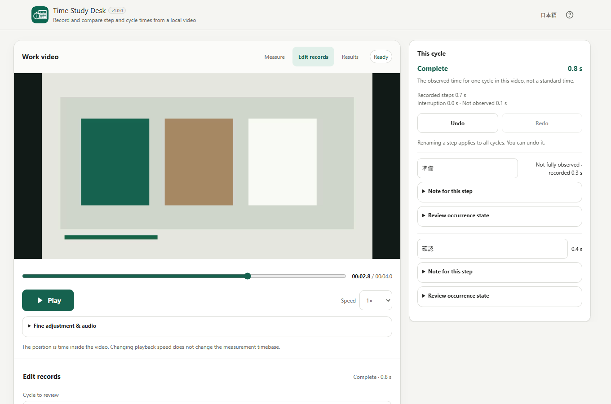

# Time Study Desk

[](https://github.com/ttomohisa/htmlapps-time-study-desk/actions/workflows/test-app.yml)
[](LICENSE)
[](https://github.com/ttomohisa/htmlapps-time-study-desk/actions/workflows/build-standalone.yml)

[日本語版 README](README.ja.md)

Measure the time spent on each step of a repeated task **from a recorded video**. Mark step boundaries, review and correct the records, compare cycles, and jump from a result back to the corresponding video interval. No account or installation is required; the app does not upload your videos or observations.

## 🚀 Live demo

### [Open Time Study Desk on GitHub Pages](https://ttomohisa.github.io/htmlapps-time-study-desk/)

GitHub Pages serves the initial HTML **if Pages is enabled for this repository**. After the page loads, the app processes your video and observation records in your browser. If the demo is unavailable, use the downloadable standalone HTML under **Quick start**.

[](https://ttomohisa.github.io/htmlapps-time-study-desk/)

*Actual v1.0.0 Chromium test capture, using short synthetic video rather than a real work observation. [Mobile screenshot](assets/screenshot-mobile.png).*

## Features

- **Measure steps from a video** — Play or seek to the start, each transition and the end; the first cycle does not require a predefined step list.
- **Compare repeated work** — Start each cycle explicitly, reuse the procedure and exclude between-cycle gaps from recorded work time.
- **Record what was not measured** — Distinguish work interruptions, unobserved intervals and steps not performed; missing measurements are not counted as zero.
- **Correct records without restarting** — Rename steps, move shared boundaries, split/merge/reassign intervals, change statuses and notes, and undo/redo edits.
- **Check the evidence behind a number** — Inspect cycle and step statistics, counts (n), a chart and time table; select a result to seek to its source video interval.
- **Keep and export an analysis locally** — Save analysis-only JSON, restore a browser-local autosave when available, or export time-table, summary and interval-detail CSV files.

## Quick start

### Use the web demo

[Open the demo](https://ttomohisa.github.io/htmlapps-time-study-desk/) if GitHub Pages has been enabled. No login or installation is necessary. The site must be loaded over the network initially, but video analysis does not require a server.

### Use the download file

1. Open the [standalone build workflow](https://github.com/ttomohisa/htmlapps-time-study-desk/actions/workflows/build-standalone.yml) and choose a successful run.
2. Download its **standalone-html-…** artifact ZIP (GitHub may require sign-in to download an Actions artifact).
3. Extract and open `dist/index.html` in a compatible browser. The generated `time-study-desk.html` is an identical readable copy.
4. Optionally use `dist/index.self-extract.html`, which is smaller but requires browser `DecompressionStream` support.

The files do not require a local application server or runtime library download. Save the HTML to your device for later offline use.

### Build an offline copy (advanced)

1. Download or clone this repository.
2. On Windows, run `build-standalone.bat` (PowerShell is required).
3. Open the generated `dist/index.html`, or copy it to another device for offline use.

Node.js and Playwright are **not** required to run the app; they are used for development and testing.

## Usage

1. **Load a video.** Choose one seekable video file using the file picker or drag and drop. Move the playhead to the start of the work.
2. **Measure the first cycle.** Select **Start cycle here**; at each step change, select **Mark boundary**; at the end, select **Finish cycle here**.
3. **Record another cycle.** Select **Start next cycle here**. The next cycle never begins automatically; time between cycles is not silently added to a step.
4. **Edit records.** Open **Edit records** to name steps, adjust boundaries and correct intervals or observation statuses. A changed procedure order or start/end condition becomes a new procedure, leaving earlier records intact.
5. **Inspect results.** Select a procedure in **Results** to view cycle durations, step-level statistics and the time table. Excluding a completed cycle from statistics requires a reason.
6. **Save your work.** Download an analysis `.tsd.json` file or export the time-table, summary or interval-detail CSV separately.

### Interruptions and incomplete observations

Open **More recording options** to record an interruption or unobserved interval; use **Resume step** to return. Pausing video playback does **not** record an interruption. **Not performed** is a distinct step state, not a measured zero. Incomplete cycles remain incomplete until resolved.

### Editing and evidence playback

Moving a shared boundary updates the durations of both adjacent steps. Split, merge and reassignment preserve observed spans and do not invent missing time. A step without sufficient supporting observation may become unresolved.

Select a numeric result to open the associated interval in **Edit records**. The video seeks to the saved start position **without autoplay**. Select **Play this interval** to start playback of that segment. Exact frame-level seeking or stopping is not guaranteed.

### Keyboard shortcuts

| Shortcut | Action |
| --- | --- |
| `Space` with video player focused | Play / pause |
| `←` / `→` with player focused | Seek 0.1 seconds |
| `Shift` + arrow | Seek 1 second |
| `Ctrl` / `⌘` + `Z` | Undo a record edit (native text undo inside text inputs) |
| `Ctrl` / `⌘` + `Shift` + `Z` | Redo a record edit |
| `Esc` | Close a dialog |

### Saving, reopening and CSV

- **Analysis JSON (`.tsd.json`)** holds procedures, cycle/step boundaries, statuses and notes, **not the video itself**. Reconnect the original video after reopening. The app checks file metadata and asks for confirmation; metadata matching alone cannot prove file identity.
- **Browser autosave** stores analysis data in IndexedDB when supported. It does not store the video. Local storage may be unavailable or cleared, and is not guaranteed durable or encrypted; download JSON for an important analysis. Older tabs cannot silently overwrite newer recovery data.
- **CSV** exports three separate views: time table, summary and interval details. Output uses UTF-8 BOM, CRLF and quoted cells. Unknown values remain different from zero, and user-authored formula-like text is escaped for spreadsheet import. See [CSV format](docs/CSV_FORMAT.md).

A “download started” message confirms the handoff to the browser, not that a file was written to a particular folder.

## Publish with GitHub Pages

The repository includes a workflow to build a single HTML page and deploy it when GitHub Pages is enabled.

1. In repository **Settings → Pages → Build and deployment → Source**, select **GitHub Actions**.
2. Push to `main` or run **Deploy standalone app to GitHub Pages** in [Actions](https://github.com/ttomohisa/htmlapps-time-study-desk/actions/workflows/deploy-pages.yml).
3. When the deployment job succeeds, the app is served at `https://ttomohisa.github.io/htmlapps-time-study-desk/`.

If Pages is not enabled, the workflow builds the standalone artifact but skips deployment. Deployment and its live URL should not be assumed merely from a successful app-test run.

## Development and build layout

```text
.
├─ app.config.json                   # App metadata and build options
├─ src/index.template.html           # Editable application source
├─ build-standalone.bat              # Windows build entry point
├─ build-standalone.ps1              # Standalone HTML builder
├─ scripts/check-repository.ps1      # Build and release verification
├─ dist/index.html                   # Generated readable HTML
├─ dist/index.self-extract.html      # Generated compressed HTML
├─ time-study-desk.html              # Generated root copy (same as readable)
└─ .github/workflows/
   ├─ build-standalone.yml          # Standalone build validation
   ├─ test-app.yml                  # Unit and Chromium browser tests
   └─ deploy-pages.yml              # Conditional GitHub Pages deployment
```

Edit the source template and rebuild; **do not manually edit generated HTML**. To build and verify on Windows:

```powershell
pwsh -NoProfile -File ./scripts/check-powershell-syntax.ps1
pwsh -NoProfile -File ./scripts/check-repository.ps1
```

Development tests use Node.js 22 and pinned Playwright 1.57.0:

```sh
npm ci
npx playwright install chromium
npm run test:unit
npm run test:e2e -- --project=chromium
```

Builds produce two self-contained HTML variants, verify their relationship and check the runtime network policy. Read [APP_SPEC.md](APP_SPEC.md), [save format](docs/SAVE_FORMAT.md) and [QA results](docs/QA_RESULTS.md) for details. Browser-test screenshots and results are also available in the **time-study-evidence-…** artifact of the [app-test workflow](https://github.com/ttomohisa/htmlapps-time-study-desk/actions/workflows/test-app.yml).

## Privacy and runtime network protection

The generated app has a restrictive Content Security Policy including `connect-src 'none'` and does not request remote APIs, runtime CDNs, fonts, analytics or telemetry. The selected video is accessed with browser File/Blob URLs. Records are analyzed locally and, where supported, autosaved in local IndexedDB; export only happens when you choose to download.

Accessing GitHub or the Pages site still transfers the initial page and ordinary site requests. **The app does not send your selected video, filenames, step labels or notes to a server.** For use without an internet connection, open a downloaded HTML locally. See [SECURITY.md](SECURITY.md) and [VERIFY_OFFLINE.md](VERIFY_OFFLINE.md).

## Limitations

- One seekable, nonempty video is supported at a time, with application limits of **8 GiB and 24 hours**. Its codec must be supported by the browser; the app does not transcode.
- Video positions come from the browser's `currentTime`. Storing them as integer microseconds **does not** imply microsecond precision, frame accuracy or reconstruction of real-world duration from a sped-up video.
- Statistics describe **observed video time**, not standard time, worker rating or staffing requirements. Excluded, unobserved and not-performed cases remain distinguishable.
- Automated testing has covered Chromium on desktop and mobile-sized viewports, both languages, JSON migration, CSV and both standalone variants. **Real Android/iPhone hardware, screen readers, Safari/Firefox/Edge, large real-world videos and spreadsheet-app CSV import remain unverified**.
- Browser IndexedDB support for local `file://` pages varies. The self-extracting HTML needs `DecompressionStream` support.

The persisted analysis schema remains **schemaVersion 1** independently of the app's **v1.0.0** version.

## Dependencies

The distributed application has **no bundled third-party runtime libraries**; it uses native browser APIs and system fonts. Playwright 1.57.0 is pinned for development-only browser testing. See [THIRD_PARTY_NOTICES.md](THIRD_PARTY_NOTICES.md) for notices.

## Contributing

Bug reports and feature proposals are welcome in [GitHub Issues](https://github.com/ttomohisa/htmlapps-time-study-desk/issues). Please do not attach private videos or analyses to public issues. See [CONTRIBUTING.md](CONTRIBUTING.md).

## License

Copyright © 2026 ttomohisa

Licensed under the [MIT License](LICENSE).
